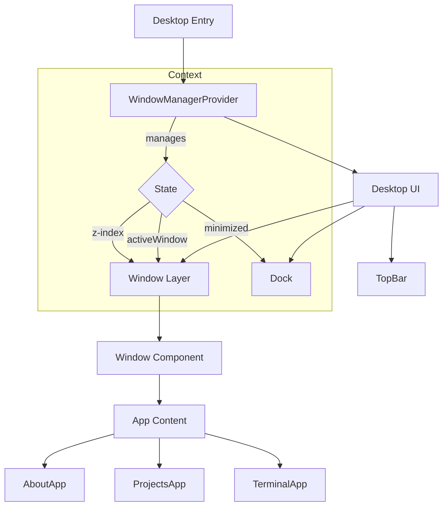

# CahyadiOS 🖥️

A personal portfolio website re-imagined as a functional, interactive Desktop Environment. Built with **React**, **Vite**, **TypeScript**, and **Framer Motion**, powered by **Bun**.


## 🌟 Features

-   **Desktop Environment**: A fully interactive desktop with a customizable wallpaper and top bar.
-   **Window System**: Drag, minimize, close, and stack windows just like a real OS.
-   **Dock**: A macOS-inspired dock with bouncy animations and tooltip indicators.
-   **Apps**:
    -   **About Me**: Profile, tech stack, and timeline-based experience tracking.
    -   **Projects**: Grid gallery showcasing portfolio work with hover effects.
    -   **Terminal**: Interactive shell with typing animations and custom commands.
-   **Glassmorphism**: Premium UI design with blur effects, noise textures, and smooth spring animations.

## 🛠️ Tech Stack

-   **Runtime**: [Bun](https://bun.sh) (Fast JavaScript runtime)
-   **Framework**: [React](https://react.dev) + [Vite](https://vitejs.dev)
-   **Language**: TypeScript
-   **Styling**: [Tailwind CSS](https://tailwindcss.com)
-   **Animations**: [Framer Motion](https://www.framer.com/motion/)
-   **Icons**: [Lucide React](https://lucide.dev)

## 🏗️ Architecture

The application is structured around a central **WindowManager** context that handles the state of the "Operating System".



## 🚀 Getting Started

1.  **Clone the repository**:
    ```bash
    git clone https://github.com/cahyadip/portfolio.git
    cd portfolio
    ```

2.  **Install dependencies**:
    ```bash
    bun install
    ```

3.  **Run development server**:
    ```bash
    bun run dev
    ```

4.  **Build for production**:
    ```bash
    bun run build
    ```

## 🎨 Design System

-   **Font**: San Francisco (Apple System Font) / Inter
-   **Colors**: Slate & Zinc palettes with dynamic gradients.
-   **Effects**:
    -   `backdrop-blur-2xl` for glass panels.
    -   `bg-noise` utility for texture.
    -   `spring` transitions for natural movement.

---

© 2026 Cahyadi Prasetyo. Built with ❤️ and ☕.
